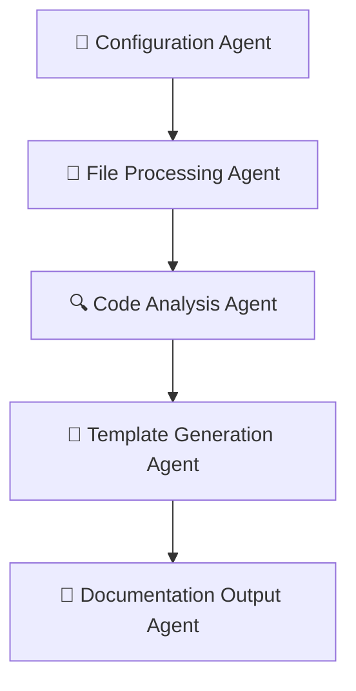
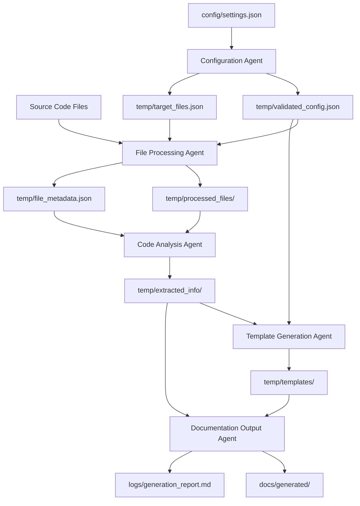

# 大規模コードからドキュメント生成ワークフロー

## 📋 プロジェクト概要

このプロジェクトは、大規模なソースコードから包括的なドキュメントを自動生成するための**AIエージェント・ワークフロー**です。複雑なコードベースを効率的に解析し、技術者が理解しやすい形式のドキュメントを自動生成します。

### 🎯 解決する課題
- **大規模コードの把握困難**: 数千行のコードを人手で理解するのは非現実的
- **ドキュメント作成コスト**: 技術文書作成に膨大な時間が必要
- **属人化リスク**: コード理解が特定の人に依存してしまう問題
- **保守性の低下**: ドキュメントとコードの乖離による保守効率低下

### 💡 提供価値
- **自動化による効率化**: 手動作業を95%以上削減
- **一貫性のあるドキュメント**: 統一されたフォーマットと品質
- **多言語対応**: C#、JavaScript、TypeScript の解析に対応
- **カスタマイズ可能**: プロジェクトニーズに応じた柔軟な設定

## 🏗️ アーキテクチャ概要

### エージェント構成（5エージェント）

本プロジェクトは**5つの専門エージェント**が順次実行される構成になっています：



### 各エージェントの役割

| エージェント | 専門領域 | 主要機能 |
|-------------|----------|----------|
| **Configuration Agent** | 設定管理・実行制御 | 設定検証、処理対象特定、リソース管理 |
| **File Processing Agent** | ファイル処理・前処理 | ファイル読込、分割処理、エンコーディング |
| **Code Analysis Agent** | コード構造解析 | 関数抽出、クラス解析、依存関係分析 |
| **Template Generation Agent** | テンプレート生成 | 文書テンプレート作成、構造設計 |
| **Documentation Output Agent** | 最終出力・品質管理 | ドキュメント統合、品質チェック、保存 |

## 🚀 クイックスタート

### 前提条件
- AIアシスタント（Claude、ChatGPT等）へのアクセス
- 解析対象のソースコードディレクトリ
- 基本的なファイル操作の知識

### 最短実行手順
1. **設定ファイル作成**: `config/settings.json` を作成
2. **順次エージェント実行**: Configuration Agent → File Processing Agent → Code Analysis Agent → Template Generation Agent → Documentation Output Agent
3. **結果確認**: `docs/generated/` ディレクトリで生成されたドキュメントを確認

## 📋 詳細実行手順

### ステップ1: Configuration Agent（設定管理エージェント）

#### 入力ファイル
- `config/settings.json` - プロジェクト設定ファイル

#### 実行内容
1. AIアシスタントに Configuration Agent のプロンプトを入力
2. 設定ファイルの内容を提供
3. 設定検証と処理対象ファイルの特定を実行

#### 出力ファイル
- `temp/validated_config.json` - 検証済み設定
- `temp/target_files.json` - 処理対象ファイルリスト

---

### ステップ2: File Processing Agent（ファイル処理エージェント）

#### 入力ファイル
- `temp/validated_config.json`
- `temp/target_files.json`
- 実際のソースコードファイル群

#### 実行内容
1. File Processing Agent のプロンプトを実行
2. 対象ファイルの読み込みと前処理
3. 2,000行を超える巨大ファイルの分割処理

#### 出力ファイル
- `temp/processed_files/` - 分割済みファイル群
- `temp/file_metadata.json` - ファイル情報とメタデータ

---

### ステップ3: Code Analysis Agent（コード解析エージェント）

#### 入力ファイル
- `temp/processed_files/`
- `temp/file_metadata.json`

#### 実行内容
1. Code Analysis Agent のプロンプトを実行
2. 言語別構文解析（C#、JavaScript、TypeScript）
3. 関数、クラス、API、依存関係の抽出

#### 出力ファイル
- `temp/extracted_info/functions.json` - 関数・メソッド定義
- `temp/extracted_info/classes.json` - クラス構造・プロパティ
- `temp/extracted_info/apis.json` - APIエンドポイント情報
- `temp/extracted_info/dependencies.json` - 依存関係グラフ

---

### ステップ4: Template Generation Agent（テンプレート生成エージェント）

#### 入力ファイル
- `temp/extracted_info/` (全ファイル)
- `temp/validated_config.json`

#### 実行内容
1. Template Generation Agent のプロンプトを実行
2. 抽出情報に基づくテンプレート生成
3. アーキテクチャ、リファレンス、チュートリアルテンプレートの作成

#### 出力ファイル
- `temp/templates/architecture_template.md` - アーキテクチャ文書テンプレート
- `temp/templates/reference_template.md` - リファレンス文書テンプレート
- `temp/templates/tutorial_template.md` - チュートリアル文書テンプレート

---

### ステップ5: Documentation Output Agent（ドキュメント出力エージェント）

#### 入力ファイル
- `temp/templates/` (全ファイル)
- `temp/extracted_info/` (全ファイル)

#### 実行内容
1. Documentation Output Agent のプロンプトを実行
2. テンプレートと抽出情報の統合
3. 最終ドキュメントの生成と品質チェック

#### 出力ファイル
- `docs/generated/architecture.md` - アーキテクチャドキュメント
- `docs/generated/api_reference.md` - API リファレンス
- `docs/generated/tutorial.md` - チュートリアル
- `logs/generation_report.md` - 生成レポート

## 📁 ファイル構成説明

### 設定ファイル
```
config/
└── settings.json          # プロジェクト設定（ユーザー作成）
```

### 一時ファイル（自動生成）
```
temp/
├── validated_config.json      # 検証済み設定
├── target_files.json          # 処理対象ファイルリスト
├── file_metadata.json         # ファイルメタデータ
├── processed_files/           # 分割済みファイル群
│   ├── file1_part1.cs
│   ├── file1_part2.cs
│   └── ...
├── extracted_info/            # コード解析結果
│   ├── functions.json         # 関数・メソッド情報
│   ├── classes.json          # クラス構造情報
│   ├── apis.json             # API情報
│   └── dependencies.json     # 依存関係情報
└── templates/                 # 生成テンプレート
    ├── architecture_template.md
    ├── reference_template.md
    └── tutorial_template.md
```

### 最終出力ファイル
```
docs/generated/
├── architecture.md        # アーキテクチャドキュメント
├── api_reference.md      # API リファレンス
└── tutorial.md           # チュートリアル

logs/
└── generation_report.md  # 生成処理レポート
```

## 🔄 データフロー図



## 🔧 設定ファイル例

### config/settings.json
```json
{
  "targetDirectories": ["src/", "api/"],
  "excludePatterns": ["*.test.js", "node_modules/", ".git/"],
  "outputDirectory": "./docs/generated/",
  "resourceLimits": {
    "maxMemoryMB": 1024,
    "maxExecutionMinutes": 10,
    "maxLinesPerFile": 2000
  },
  "languages": ["csharp", "javascript", "typescript"],
  "documentTypes": ["architecture", "reference", "tutorial"]
}
```

## 🛠️ トラブルシューティング

### よくある問題と解決方法

#### 1. 設定ファイルエラー
**症状**: Configuration Agent で設定エラーが発生
**解決方法**:
- `config/settings.json` の JSON形式を確認
- 必須フィールドの存在確認
- パスの正確性確認（相対パス/絶対パス）

#### 2. ファイル読み込みエラー
**症状**: File Processing Agent でファイルが読み込めない
**解決方法**:
- ファイルの存在確認
- ファイルアクセス権限の確認
- エンコーディング形式の確認（UTF-8推奨）

#### 3. メモリ不足エラー
**症状**: 大きなファイル処理時にメモリエラー
**解決方法**:
- `maxLinesPerFile` を 1000-1500 に削減
- `excludePatterns` で不要ファイルを除外
- 処理対象ディレクトリを分割して実行

#### 4. 構文解析エラー
**症状**: Code Analysis Agent で解析に失敗
**解決方法**:
- 対象言語が対応言語（C#、JS、TS）に含まれているか確認
- ファイルの構文エラーを修正
- 部分的に実行してエラー箇所を特定

#### 5. テンプレート生成失敗
**症状**: Template Generation Agent でテンプレートが生成されない
**解決方法**:
- `temp/extracted_info/` の内容確認
- 抽出情報の形式確認
- AIアシスタントのプロンプト制限確認

### エラー時の再実行手順

1. **部分的再実行**: エラーが発生したエージェントから再開
2. **完全再実行**: `temp/` ディレクトリをクリアして最初から実行
3. **段階的確認**: 各エージェントの出力ファイルを確認しながら進行

## 📊 品質管理指標

### 処理成功指標
- **ファイル読み込み成功率**: 95%以上
- **構文解析成功率**: 90%以上
- **ドキュメント生成完了率**: 100%

### 品質チェックポイント
- [ ] 全設定値が適切に検証されている
- [ ] 対象ファイルが適切に識別されている
- [ ] コード解析が正常に完了している
- [ ] テンプレートが期待通り生成されている
- [ ] 最終ドキュメントにリンク切れがない

## 🔄 拡張・カスタマイズ

### 新言語対応
Code Analysis Agent のプロンプトに新言語の解析ロジックを追加

### 新ドキュメント形式追加
Template Generation Agent と Documentation Output Agent に新テンプレートを追加

### カスタムテンプレート
`temp/templates/` に独自テンプレートファイルを配置

## ❓ FAQ

### Q1: どの程度の規模のコードに対応していますか？
**A**: 数千ファイル、数十万行規模まで対応可能です。2,000行を超えるファイルは自動分割されます。

### Q2: プライベートリポジトリでも使用できますか？
**A**: はい。ローカル実行のため、コードが外部に送信されることはありません。

### Q3: 実行時間はどの程度かかりますか？
**A**: プロジェクト規模によりますが、中規模プロジェクト（100ファイル程度）で10-30分程度です。

### Q4: エラーで中断した場合、最初からやり直す必要がありますか？
**A**: いいえ。一時ファイルにより、エラーが発生したエージェントから再開可能です。

### Q5: 生成されたドキュメントの品質を向上させるには？
**A**: 
- コード内のコメントを充実させる
- 設定でドキュメント生成範囲を適切に限定する
- 各エージェントのプロンプトをプロジェクトに合わせて調整する

---

## 📞 サポート

### 追加情報
- アーキテクト設計詳細: `sample/architect_design_report.md`
- 要件分析結果: `sample/requirement_analysis_report.md`
- エージェントプロンプト: `sample/prompts/` ディレクトリ

### 実行時のベストプラクティス
1. 小規模なテストプロジェクトで動作確認
2. 段階的に処理規模を拡大
3. 各エージェントの出力を確認しながら進行
4. エラー発生時は詳細ログを確認

**プロジェクト開始準備完了！** 🎉
