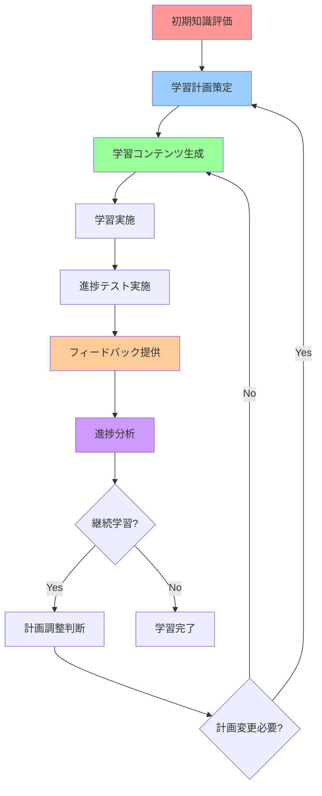

# エージェント・アーキテクチャ設計書

## エージェント構成概要

F#学習フローシステムを実現するため、以下の5つの専門エージェントで構成されたアーキテクチャを提案します。各エージェントは特定の専門領域に責任を持ち、ファイルベースでのデータ交換により連携します。

```
[知識評価エージェント] → [学習計画エージェント] → [コンテンツ生成エージェント]
        ↑                                                      ↓
[進捗分析エージェント] ← [フィードバック提供エージェント] ←──────┘
        ↑                        ↓
        └────── [ループ制御] ──────┘
```

## 各エージェントの役割定義

### 1. 知識評価エージェント (Knowledge Assessment Agent)
- **専門領域**: F#知識レベルの評価・テスト設計・実施
- **主要責任**: 
  - ユーザのF#理解度を正確に測定
  - 適切な難易度のテスト問題を生成
  - テスト結果の客観的評価
- **特徴**: 教育測定学とF#言語仕様の専門知識

### 2. 学習計画エージェント (Learning Plan Agent)
- **専門領域**: 個別化学習戦略の策定・最適化
- **主要責任**:
  - 知識評価結果に基づく学習経路の設計
  - 学習目標の明確化と段階的計画の構築
  - 学習リソースの優先順位付け
- **特徴**: 教育工学とパーソナライズ学習の専門知識

### 3. コンテンツ生成エージェント (Content Generation Agent)
- **専門領域**: F#学習コンテンツの作成・品質管理
- **主要責任**:
  - 学習計画に基づくマークダウン形式の学習資料作成
  - 実践的なコード例とわかりやすい説明の提供
  - コンテンツの難易度調整と構造化
- **特徴**: F#実践開発とテクニカルライティングの専門知識

### 4. フィードバック提供エージェント (Feedback Provider Agent)
- **専門領域**: 学習効果の分析・改善提案
- **主要責任**:
  - テスト結果の詳細分析と解説提供
  - 学習の弱点特定と改善方法の提案
  - モチベーション維持のための建設的フィードバック
- **特徴**: 教育心理学と学習分析の専門知識

### 5. 進捗分析エージェント (Progress Analysis Agent)
- **専門領域**: 学習進捗の監視・分析・計画調整
- **主要責任**:
  - 累積的な学習データの分析
  - 学習効果の定量的評価
  - 学習計画の動的調整判断
- **特徴**: データ分析と適応的学習システムの専門知識

## ワークフロー図



## データフロー仕様

### 入力ファイル
- **初期入力**: `INPUT/user_profile.md` (ユーザ基本情報)

### エージェント間データフロー

#### 1. 知識評価エージェント
- **入力**: 
  - `INPUT/user_profile.md` (初期評価時)
  - `data/previous_test_results.md` (再評価時)
- **出力**: 
  - `data/knowledge_assessment_results.md` (評価結果)
  - `data/test_questions.md` (実施したテスト問題)

#### 2. 学習計画エージェント
- **入力**: 
  - `data/knowledge_assessment_results.md`
  - `data/progress_analysis_report.md` (計画調整時)
- **出力**: 
  - `data/learning_plan.md` (個別学習計画)
  - `data/learning_objectives.md` (学習目標詳細)

#### 3. コンテンツ生成エージェント
- **入力**: 
  - `data/learning_plan.md`
  - `data/learning_objectives.md`
- **出力**: 
  - `content/lesson_[topic_id].md` (各トピック学習資料)
  - `content/code_examples_[topic_id].md` (コード例集)

#### 4. フィードバック提供エージェント
- **入力**: 
  - `data/knowledge_assessment_results.md`
  - `data/learning_plan.md`
  - `data/test_questions.md`
- **出力**: 
  - `feedback/detailed_feedback.md` (詳細フィードバック)
  - `feedback/improvement_suggestions.md` (改善提案)

#### 5. 進捗分析エージェント
- **入力**: 
  - `data/knowledge_assessment_results.md`
  - `data/learning_plan.md`
  - `feedback/detailed_feedback.md`
  - `data/learning_history.md` (蓄積された学習履歴)
- **出力**: 
  - `data/progress_analysis_report.md` (進捗分析結果)
  - `data/learning_history.md` (更新された学習履歴)
  - `data/adaptation_recommendations.md` (計画調整推奨)

### ユーザインタフェースファイル
- **ユーザ提供**: `output/current_lesson.md` (現在の学習資料)
- **ユーザ提供**: `output/current_feedback.md` (現在のフィードバック)
- **ユーザ入力**: `INPUT/test_answers.md` (テスト回答)
- **ユーザ入力**: `INPUT/learning_request.md` (学習継続意思・要望)

## ループ実行の仕組み

### 実行順序
1. **初回実行**: 知識評価 → 学習計画 → コンテンツ生成 → フィードバック提供
2. **ループ実行**: 進捗分析 → (計画調整判断) → 知識評価 → 学習計画 → コンテンツ生成 → フィードバック提供
3. **継続判断**: 各サイクル終了時にユーザの継続意思を確認

### ループ制御メカニズム
- **継続条件**: `INPUT/learning_request.md`での継続意思表明
- **調整判断**: `data/adaptation_recommendations.md`での計画変更推奨
- **終了条件**: ユーザの学習完了意思表明または目標達成

### データ永続化
- 全ての学習履歴は`data/learning_history.md`に蓄積
- 各サイクルの結果は`archive/cycle_[number]/`フォルダに保存
- ユーザプロファイルは学習進捗に応じて`data/user_profile_updated.md`として更新

## 品質基準

### 責任分離の明確性
- 各エージェントは単一の専門領域に集中
- エージェント間の依存関係は明確なファイルインタフェースで定義
- 機能重複の排除とモジュール性の確保

### ワークフローの効率性
- ファイルベースの非同期処理により効率的な実行
- 必要時のみの計画調整により無駄な処理を削減
- ユーザの学習ペースに応じた柔軟なスケジューリング

### 拡張性とメンテナンス性
- 新しい評価方法や学習手法の追加が容易
- 各エージェントの独立的な改善・更新が可能
- 標準化されたファイル形式により他システムとの連携が容易
