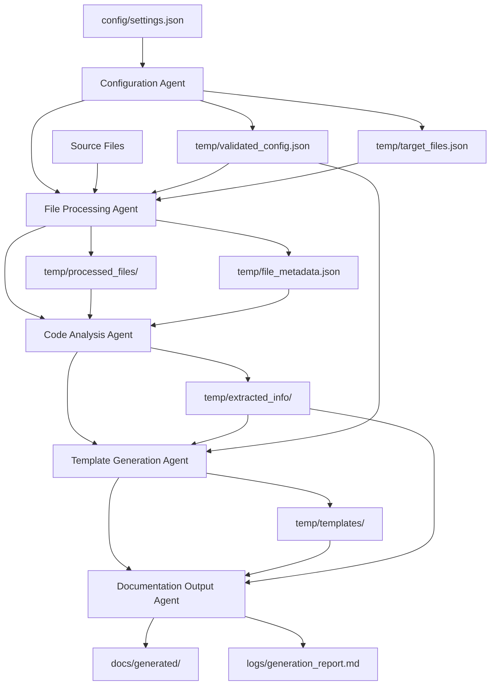

# アーキテクト設計レポート

## 📋 プロジェクト概要
**プロジェクト名**: 大規模コードからドキュメント生成ワークフロー  
**設計日時**: 2025年7月23日  
**設計対象**: 要件分析結果に基づくエージェント構成とワークフロー設計

## 🏗️ エージェント構成概要

### 設計原則に基づく分割戦略
- **単一責任原則**: 各エージェントは明確に分離された専門領域を担当
- **効率性**: 最小限のエージェント数（5エージェント）で最大効果を実現
- **拡張性**: 将来の要件変更に対応しやすい疎結合設計
- **保守性**: 理解しやすく修正しやすい構造

### エージェント数: 5エージェント
1. **Configuration Agent** (設定管理エージェント)
2. **File Processing Agent** (ファイル処理エージェント)
3. **Code Analysis Agent** (コード解析エージェント)
4. **Template Generation Agent** (テンプレート生成エージェント)
5. **Documentation Output Agent** (ドキュメント出力エージェント)

## 🎯 各エージェントの役割定義

### 1. Configuration Agent (設定管理エージェント)
**専門領域**: 設定ファイル管理、実行制御、リソース管理

**責任範囲**:
- JSON設定ファイルの読み込み・検証
- 処理対象ファイル・ディレクトリの特定
- 除外パターンの適用
- リソース制限の監視・制御
- エラー処理方針の設定

**入力**:
- `config/settings.json` (ユーザー設定ファイル)
- コマンドライン引数・環境変数

**出力**:
- `temp/validated_config.json` (検証済み設定)
- `temp/target_files.json` (処理対象ファイルリスト)

### 2. File Processing Agent (ファイル処理エージェント)
**専門領域**: ファイル読み込み、前処理、分割処理

**責任範囲**:
- ターゲットファイルの読み込み
- 2,000行制限による巨大ファイル分割
- ファイル形式の検証・識別
- エンコーディング処理
- 一時ファイル管理

**入力**:
- `temp/target_files.json`
- 実際のソースコードファイル群

**出力**:
- `temp/processed_files/` (分割済みファイル群)
- `temp/file_metadata.json` (ファイル情報)

### 3. Code Analysis Agent (コード解析エージェント)
**専門領域**: コード構造解析、情報抽出

**責任範囲**:
- 言語別構文解析 (C#, JavaScript, TypeScript)
- 関数/メソッド定義の抽出
- クラス構造・プロパティの解析
- API エンドポイントの特定
- コメント・docstring の抽出
- 依存関係グラフの生成
- 型定義・インターフェースの解析

**入力**:
- `temp/processed_files/`
- `temp/file_metadata.json`

**出力**:
- `temp/extracted_info/functions.json`
- `temp/extracted_info/classes.json`
- `temp/extracted_info/apis.json`
- `temp/extracted_info/dependencies.json`

### 4. Template Generation Agent (テンプレート生成エージェント)
**専門領域**: ドキュメントテンプレート作成、構造設計

**責任範囲**:
- 設計書・アーキテクチャ文書テンプレート生成
- 開発者向けリファレンステンプレート作成
- チュートリアル・FAQ テンプレート設計
- テンプレート品質チェック
- カスタムテンプレート対応

**入力**:
- `temp/extracted_info/` (全抽出情報)
- `temp/validated_config.json`

**出力**:
- `temp/templates/architecture_template.md`
- `temp/templates/reference_template.md`
- `temp/templates/tutorial_template.md`

### 5. Documentation Output Agent (ドキュメント出力エージェント)
**専門領域**: 最終ドキュメント生成、品質管理、保存

**責任範囲**:
- テンプレートと抽出情報の統合
- Markdown形式での最終出力生成
- 文書構造の整合性チェック
- リンク切れチェック
- ドキュメントカバレッジ測定
- 指定ディレクトリへの保存
- Git連携によるバージョン管理

**入力**:
- `temp/templates/`
- `temp/extracted_info/`

**出力**:
- `docs/generated/architecture.md`
- `docs/generated/api_reference.md`
- `docs/generated/tutorial.md`
- `logs/generation_report.md`

## 🔄 ワークフロー設計

### 実行順序 (順次実行)


### ループ実行対応設計
1. **ファイル単位ループ**: 複数ファイル処理時は File Processing Agent から繰り返し
2. **分割ファイルループ**: 巨大ファイル分割時は Code Analysis Agent 内でループ
3. **エラー時再試行**: 各エージェントでエラー検出時、前段階から再実行可能
4. **部分処理継続**: 一時ファイルによる中間状態保存で、任意の段階から再開可能

## 📊 データフロー仕様

### 入力データフロー
```
ユーザー設定 → Configuration Agent
├─ config/settings.json
├─ コマンドライン引数
└─ 環境変数

ソースコード → File Processing Agent
├─ .cs, .js, .ts, .aspx files
├─ .md, .txt, .json, .yaml files
└─ ディレクトリ構造
```

### 中間データフロー
```
temp/validated_config.json → 全エージェント
temp/target_files.json → File Processing Agent
temp/processed_files/ → Code Analysis Agent
temp/file_metadata.json → Code Analysis Agent
temp/extracted_info/ → Template Generation Agent
temp/templates/ → Documentation Output Agent
```

### 出力データフロー
```
Documentation Output Agent →
├─ docs/generated/architecture.md
├─ docs/generated/api_reference.md
├─ docs/generated/tutorial.md
└─ logs/generation_report.md
```

## 📁 ファイル仕様詳細

### 設定ファイル (config/settings.json)
```json
{
  "targetDirectories": ["src/", "api/"],
  "excludePatterns": ["*.test.js", "node_modules/", ".git/"],
  "outputDirectory": "./docs/generated/",
  "resourceLimits": {
    "maxMemoryMB": 1024,
    "maxExecutionMinutes": 10,
    "maxLinesPerFile": 2000
  },
  "languages": ["csharp", "javascript", "typescript"],
  "documentTypes": ["architecture", "reference", "tutorial"]
}
```

### 一時ファイル構造
```
temp/
├─ validated_config.json      # 検証済み設定
├─ target_files.json          # 処理対象ファイルリスト
├─ file_metadata.json         # ファイルメタデータ
├─ processed_files/           # 分割済みファイル群
│  ├─ file1_part1.cs
│  ├─ file1_part2.cs
│  └─ ...
├─ extracted_info/            # 抽出情報
│  ├─ functions.json
│  ├─ classes.json
│  ├─ apis.json
│  └─ dependencies.json
└─ templates/                 # 生成テンプレート
   ├─ architecture_template.md
   ├─ reference_template.md
   └─ tutorial_template.md
```

## ⚡ 処理効率最適化

### エージェント間最適化
- **データ再利用**: 中間ファイルの効率的な読み書き
- **メモリ管理**: 各エージェントでのメモリクリア実装
- **並列化準備**: 将来の並列実行に備えたデータ分離設計

### リソース制限対応
- **メモリ監視**: Configuration Agent でのリソース監視機能
- **分割処理**: File Processing Agent での自動分割機能
- **時間制限**: 各エージェントでのタイムアウト制御

## 🔍 品質管理機能

### 各エージェントの品質チェック
1. **Configuration Agent**: 設定値の妥当性検証
2. **File Processing Agent**: ファイル読み込み成功率チェック
3. **Code Analysis Agent**: 構文解析成功率、抽出情報完全性チェック
4. **Template Generation Agent**: テンプレート構造整合性チェック
5. **Documentation Output Agent**: 最終品質チェック、リンク切れ検証

### 統合品質メトリクス
- ドキュメントカバレッジ率
- 抽出情報完全性スコア
- 処理成功率
- エラー発生率

## 🚀 拡張性設計

### 新機能追加対応
- **新言語対応**: Code Analysis Agent の解析ロジック追加
- **新テンプレート**: Template Generation Agent のテンプレート追加
- **新出力形式**: Documentation Output Agent の出力形式追加

### プラグイン対応準備
- 各エージェントの設定ベース動作切り替え
- 外部ツール連携のためのインターフェース設計
- カスタムテンプレートの動的読み込み機能

## ✅ 品質チェックポイント確認

- [x] 全要件がエージェントに適切に分割されている
- [x] 各エージェントの責任が明確に分離されている
- [x] ワークフローが効率的に設計されている
- [x] データフローが明確に定義されている
- [x] ループ実行が可能な構造になっている
- [x] 将来の拡張性が考慮されている

## 📝 実装ガイドライン

### 実行順序の遵守
1. 必ず Configuration Agent から開始
2. 各エージェントの完了確認後に次のエージェントを実行
3. エラー時は該当エージェントの再実行、または前段階からの再開

### ファイル管理規則
- temp/ ディレクトリは各実行開始時にクリア
- logs/ ディレクトリは履歴保持のため累積保存
- docs/generated/ は上書き保存（バージョン管理はGit連携）

### エラーハンドリング
- 各エージェントは独立したエラーハンドリングを実装
- 部分的処理結果でも有用なドキュメント生成を優先
- 詳細なエラーログを logs/ に出力

## 🎯 成功指標

1. **機能性**: 全8つの機能要件を5エージェントで実現
2. **効率性**: 最小限のエージェント数での実装
3. **保守性**: 単一責任原則に基づく明確な分離
4. **拡張性**: 新言語・新機能追加時の影響範囲最小化
5. **信頼性**: エラー時の継続・再開機能

---
**設計完了**: 2025年7月23日  
**次フェーズ**: 各エージェントのプロンプト詳細設計
