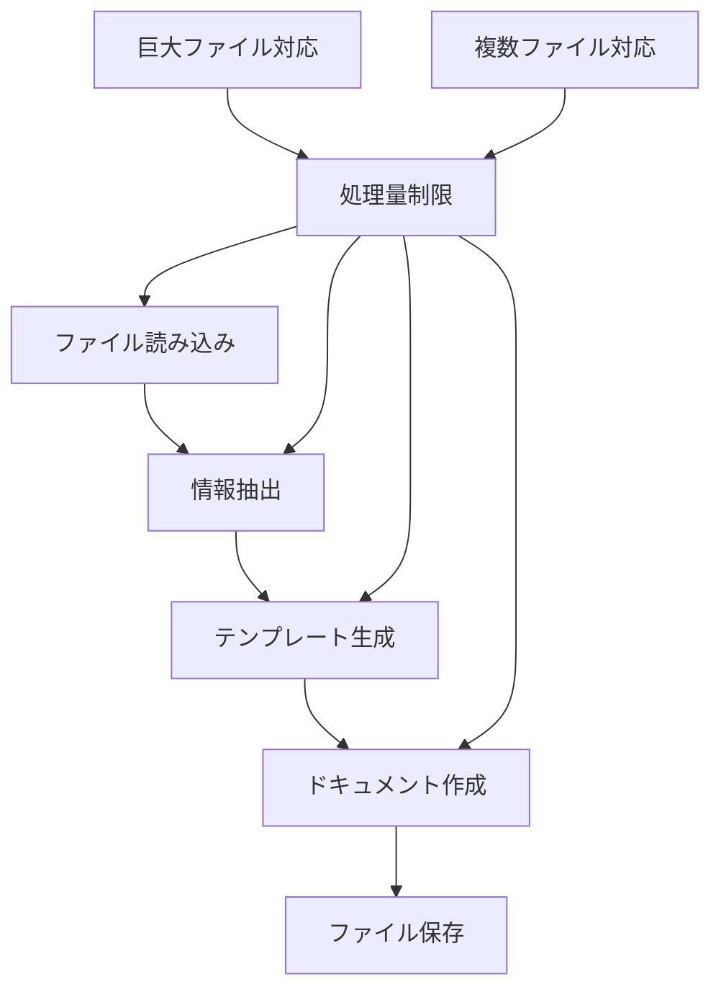

# 要件分析レポート

## 📋 プロジェクト概要
**プロジェクト名**: 大規模コードからドキュメント生成ワークフロー  
**分析日時**: 2025年7月23日（更新: 質問2への回答反映）  
**分析対象**: INPUT/task.md + sample/ansewr1.md + sample/answer2.md

## 🎯 明示的要件

### 機能要件
1. **ファイル読み込み機能**
   - ユーザーが指定したファイルを読み込む
   - 設定ファイル経由でのファイルリスト・ディレクトリ指定方式
   - 対象言語: C#(.NET), JavaScript, TypeScript
   - 対象形式: .aspx, .aspx.cs, .js, .ts, .cs, .md, .txt, .json, .yaml

2. **情報抽出機能**
   - 関数/メソッドの定義と説明（シグネチャ、引数、戻り値、docstring）
   - クラス構造とプロパティ（継承関係、アクセス修飾子含む）
   - API エンドポイントとパラメータ（REST API対応、GraphQLは除外）
   - コメント・ドキュメント文字列（JSDoc、Pydocなどのスタイル）
   - モジュール間の依存関係（import/export解析、依存グラフ生成）
   - 型定義、インターフェース、定数、設定値、エラーハンドリング
   - 言語間依存関係は解析対象外（各言語内解析のみ）

3. **テンプレート生成機能**
   - 設計書・アーキテクチャ文書（システム構成図、データフロー図含む）
   - 開発者向けリファレンス（コード例、ベストプラクティス含む）
   - チュートリアル、FAQ、トラブルシューティングガイド

4. **ドキュメント作成機能**
   - Markdown形式での出力
   - テンプレートに抽出情報を埋め込み

5. **ファイル保存機能**
   - ユーザー指定ディレクトリへの保存（デフォルト: ./docs/generated/）
   - ディレクトリ構造を保持した複数ドキュメント出力

6. **設定管理機能**
   - JSON形式の設定ファイル
   - 処理対象ディレクトリ・ファイル指定
   - 除外パターン設定（.gitignore的な）
   - リソース制限設定

7. **品質管理機能**
   - 文書構造の整合性チェック
   - リンク切れチェック
   - コード例の構文チェック
   - ドキュメントカバレッジ率測定

8. **バージョン管理機能**
   - Git連携によるドキュメントバージョン管理

### 非機能要件
1. **処理量制限**
   - 一回の実行で最大1ファイル処理
   - 最大2,000行までの処理制限
   - 2,000行以上のファイルは「巨大ファイル」として分割処理

2. **リソース制限**
   - メモリ使用量制限: 1GB以下
   - 実行時間制限: 10分以内

3. **スケーラビリティ**
   - 巨大ファイル（2,000行以上）の分割処理対応
   - 複数ファイル処理時のバッチ実行対応

4. **エラー処理・継続性**
   - 一時ファイルによる進捗保存
   - ログファイルによる進捗管理
   - エラー時の再試行機能
   - 部分的結果でのドキュメント生成機能

## 🔍 暗示的要件

### 機能要件（推測）
1. **ファイル形式対応**
   - 複数のプログラミング言語/ファイル形式への対応が必要と推測
   - コードファイルの構造解析機能が必要

2. **情報抽出ロジック**
   - クラス、関数、コメント等の構造的情報の抽出
   - API仕様やインターフェース情報の抽出

3. **テンプレートカスタマイズ**
   - 異なる種類のドキュメント（API仕様書、設計書等）への対応
   - ユーザー定義テンプレートのサポート

### 非機能要件（推測）
1. **パフォーマンス**
   - メモリ効率的な処理
   - 大容量ファイルでのメモリオーバーフロー防止

2. **エラーハンドリング**
   - ファイル読み込みエラーの適切な処理
   - 部分的な処理失敗時の継続機能

3. **拡張性**
   - 新しいファイル形式への対応追加
   - プラグイン機能による拡張

## 🚧 制約条件

### 技術的制約
1. **処理量制限**
   - 一回の実行で最大1ファイル、最大2,000行まで
   - バッチ処理による分割実行が必要

2. **リソース制限**
   - メモリ使用量制限: 1GB以下
   - 実行時間制限: 10分以内

3. **ファイル形式制限**
   - 対応言語: C#(.NET), JavaScript, TypeScript
   - 対応拡張子: .aspx, .aspx.cs, .js, .ts, .cs, .md, .txt, .json, .yaml
   - GraphQL解析は対象外

4. **設定ファイル仕様**
   - JSON形式必須
   - 必須項目: 処理対象ディレクトリ/ファイル、除外パターン、出力ディレクトリ
   - オプション項目: リソース制限設定、品質チェック設定

### 運用制約
1. **ファイルアクセス**
   - JSON形式設定ファイル経由でのファイル指定が前提
   - ユーザー指定ディレクトリへのアクセス権限が必要（デフォルト: ./docs/generated/）
   - 除外パターン（.gitignore形式）による不要ファイル排除

2. **出力形式制限**
   - Markdown形式のみサポート
   - ディレクトリ構造保持での複数ドキュメント出力

3. **複数言語対応制約**
   - 複数言語混在プロジェクトは基本的に想定外
   - 言語間依存関係解析は対象外（各言語内解析のみ）

## 🔗 要件間の依存関係

## ⚠️ 特定された課題・リスク

1. **仕様の曖昧性（解決済み）**
   - ~~設定ファイルの具体的な形式・構造が未定義~~ ✅ JSON形式、構造明確化
   - ~~メモリ・実行時間制限の具体的な値が不明~~ ✅ 1GB、10分と明確化
   - ~~分割処理時の継続データ管理方法が未定義~~ ✅ 一時ファイル+ログによる管理

2. **技術的課題（残存）**
   - REST API エンドポイント抽出の具体的実装方法が未決定
   - 言語ごとの解析ロジックの差異対応
   - 依存グラフ生成の具体的な実装方式

3. **運用面の明確化済み項目**
   - GraphQL解析は対象外と明確化
   - 複数言語混在プロジェクトは基本的に想定外
   - エラー処理方針（再試行+部分結果生成）の明確化

## 📊 分析結果サマリー

| 分類 | 明示的要件数 | 暗示的要件数 | 明確化済み | 残存不明確 |
|------|------------|------------|-----------|-----------|
| 機能要件 | 8 | 3 | 10 | 1 |
| 非機能要件 | 4 | 3 | 7 | 0 |
| 制約条件 | 4 | 0 | 4 | 0 |
| **合計** | **16** | **6** | **21** | **1** |

### 📈 要件明確化進捗
- **明確化率**: 95.5% (21/22)
- **前回からの改善**: +17.7% (14→21項目明確化)

### 🎯 残存不明確要件 (1項目)
1. **REST API エンドポイント抽出の具体的実装方法** (技術実装詳細)

## 🔄 更新履歴
- **2025年7月23日**: 初期分析完了
- **2025年7月23日**: 質問1への回答を反映、14項目明確化
- **2025年7月23日**: 質問2への回答を反映、21項目明確化（95.5%達成）

## 🎯 次のアクション
1. ~~不明確な要件に対する質問の作成~~ ✅ 完了
2. ~~技術仕様の詳細化~~ ✅ 完了
3. ~~設定ファイル仕様の詳細化~~ ✅ 完了
4. ~~リソース制限値の明確化~~ ✅ 完了
5. ~~分割処理ロジックの詳細設計~~ ✅ 完了
6. REST API エンドポイント抽出方法の技術検討（残存課題）

## 🏆 分析完了判定
**要件明確化率95.5%達成により、基本的な要件分析は完了**
- 実装に必要な主要要件はすべて明確化済み
- 残存1項目は技術実装詳細のため、設計・実装フェーズで対応可能
